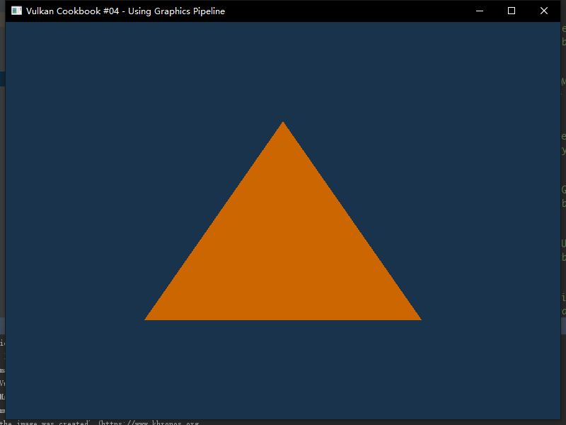
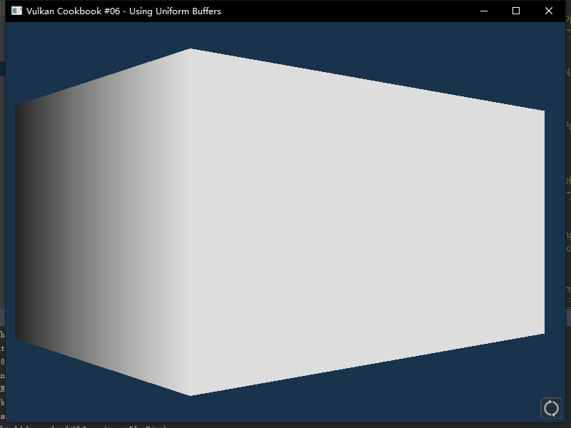
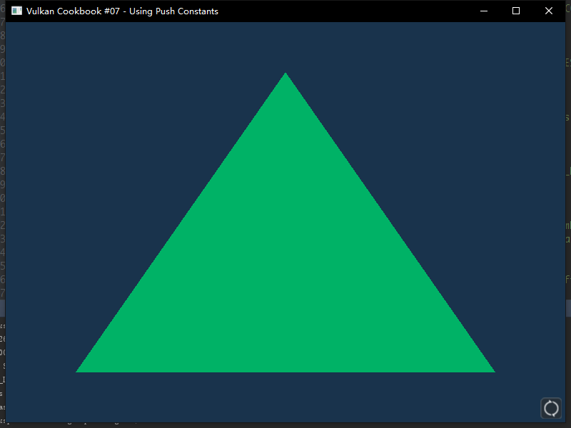
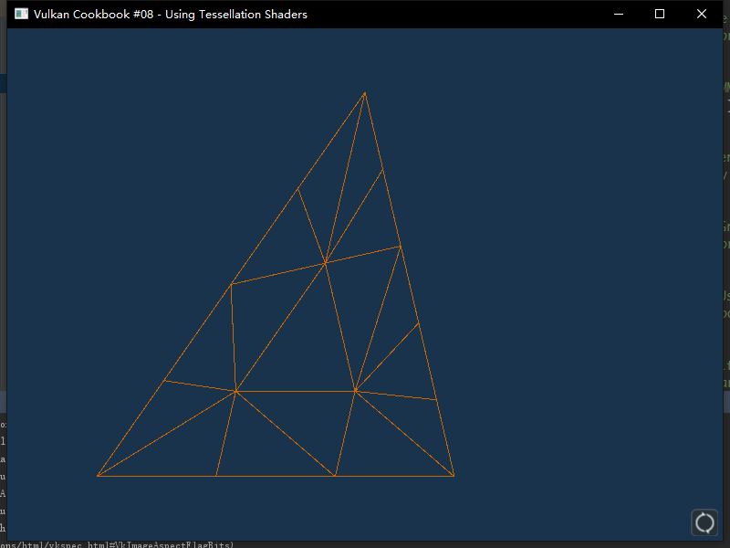
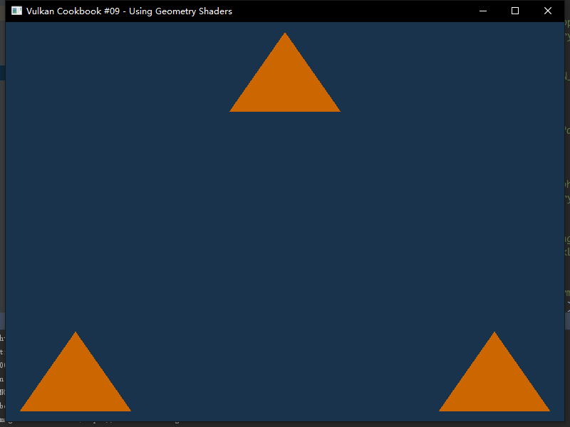
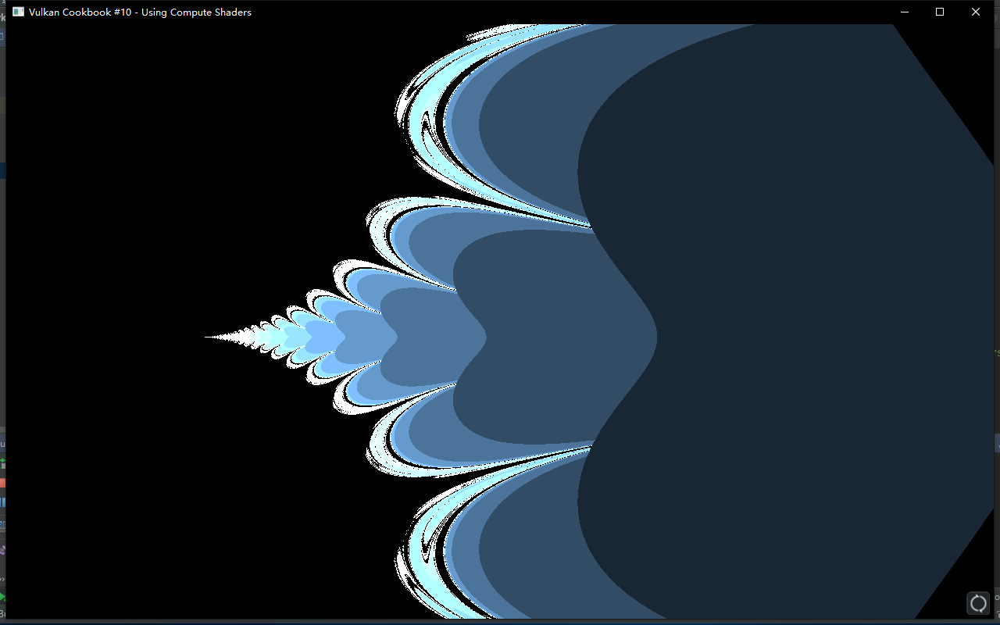
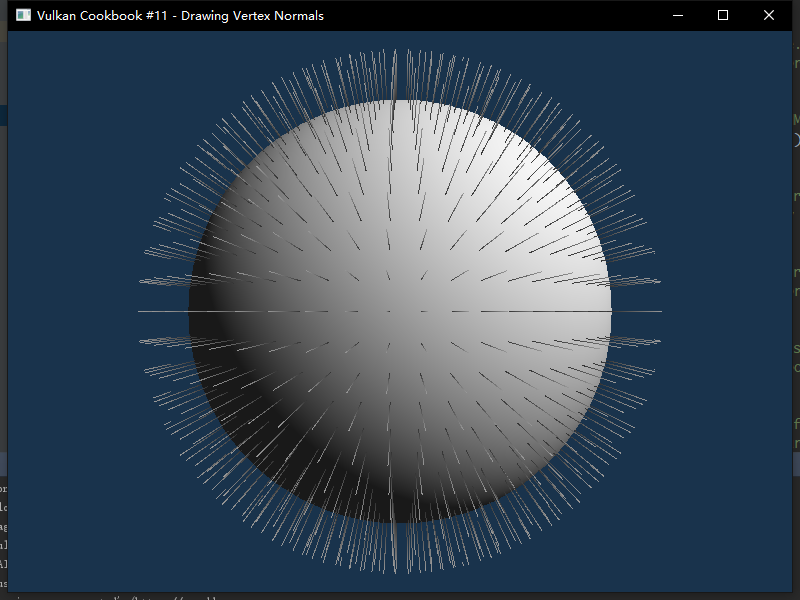
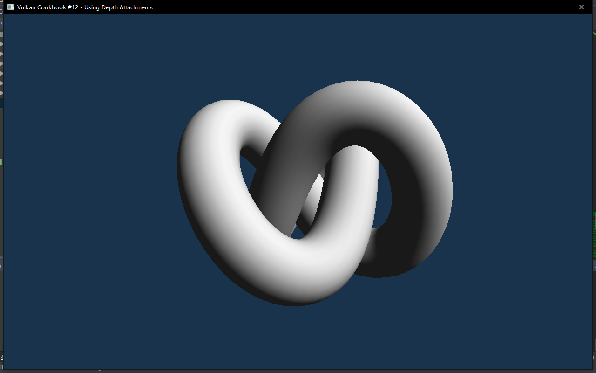

# vkCookBook
vulkan cookbook source code

# ScreenShots

## Simple demos

### 04-Using_Graphics_Pipeline

### 05-Using_Combined_Image_Samplers

### 06-Using_Uniform_Buffers

### 07-Using_Push_Constants

### 08-Using_Tessellation_Shaders

### 09-Using_Geometry_Shaders

### 10-Using_Compute_Shaders

### 11-Drawing_Vertex_Normals

### 12-Using_Depth_Attachments

## Vulkan CookBook Chapter 11 Lighting

### 01-Rendering_a_geometry_with_vertex_diffuse_lighting

### 02-Rendering_a_geometry_with_fragment_specular_lighting

### 03-Rendering_a_normal_mapped_geometry

### 04-Rendering_a_reflective_and_refractive_geometry_using_cubemaps

### 05-Adding_shadows_to_the_scene

## Vulkan CookBook Chapter 12 Advanced Rendering Techniques

### 01-Drawing_a_skybox

### 02-Drawing_bilboards_using_geometry_shaders

### 03-Drawing_particles_using_compute_and_graphics_pipelines

### 04-Rendering_a_tesselated_terrain

### 05-Rendering_a_fullscreen_quad_for_postprocessing

### 06-Using_input_attachment_for_color_correction_postprocess_effect

